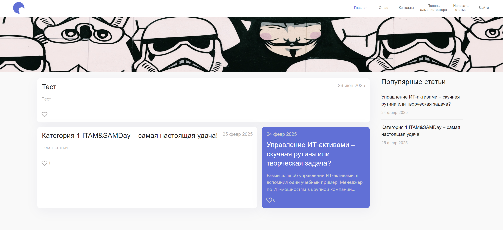

# Blog

A blog is a content management system designed for publishing articles and posts.

## Technologies

- **React**
- **TypeScript**
- **Vite**
- **React Router**
- **Redux Toolkit**
- **Firebase**

## Architecture

```
src/
├── app/                    # Global application settings and configurations
├── pages/                  # Application pages
├── features/               # Business features
│   ├── AccountMenu/        # User account menu
│   ├── AdminPanel/         # Admin panel features
│   ├── ArticlesList/       # List of articles
│   ├── CommentsList/       # List of comments
│   ├── CounterButton/      # Counter button feature
│   ├── CreateArticleForm/  # Form for creating articles
│   ├── EditArticleForm/    # Form for editing articles
│   ├── Header/             # Header component
│   └── PopularArticles/    # Popular articles feature
│
├── entities/               # Business entities
│   ├── Article/            # Articles
│   ├── Comments/           # Comments
│   └── User/               # Users
│
├── shared/                 # Reusable code
│   ├── assets/             # Static assets
│   ├── components/         # Reusable UI components
│   ├── constants/          # Application constants
│   ├── hooks/              # Custom React hooks
│   └── theme/              # Theme and styling
│
└── widgets/                # Independent widgets
    ├── Footer/             # Footer widget
    └── Header/             # Header widget
```

## Development

```bash
# Install dependencies
yarn install

# Start development server
yarn dev

# Build the project
yarn build

# Run linter
yarn lint

# Run prettier
yarn lint
```

## Preview

![Blog Preview]

## Test Users

- `anna1234@test.ru` / `8OmvtQ`
- `ivan1234@test.ru` / `pnSKx4`
- `testov@test.ru` / `1234567`
